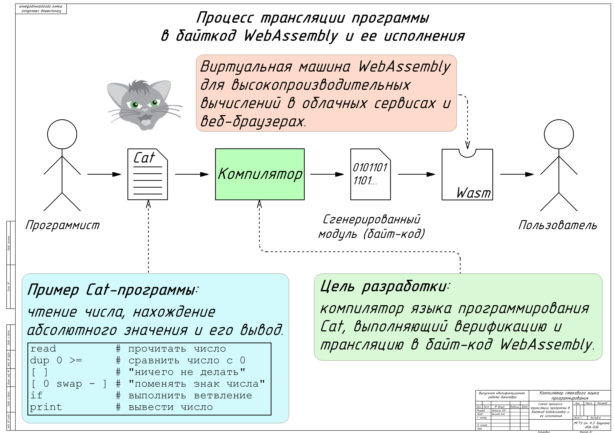
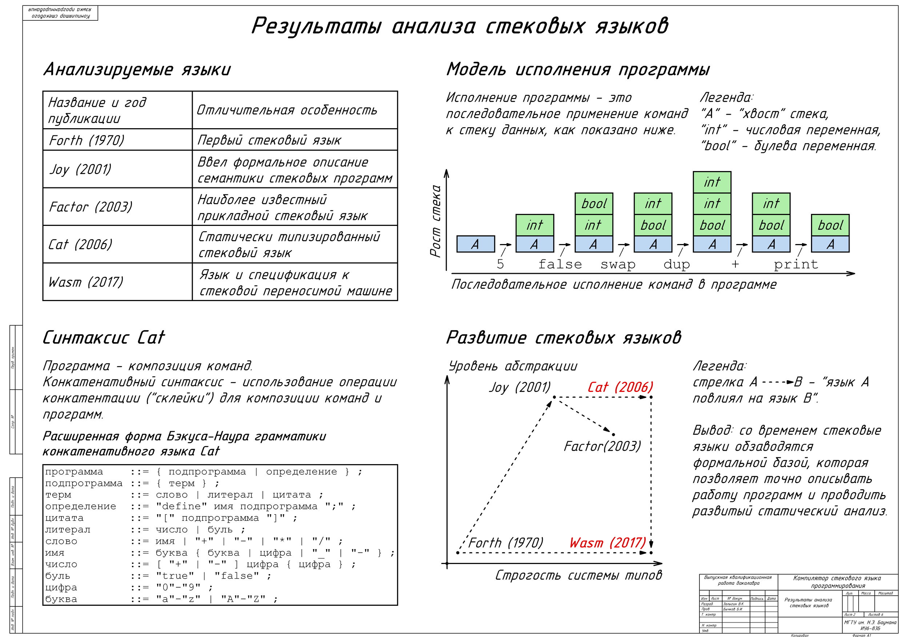
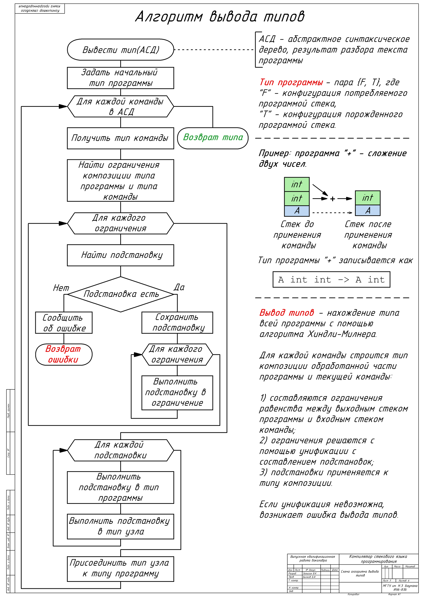
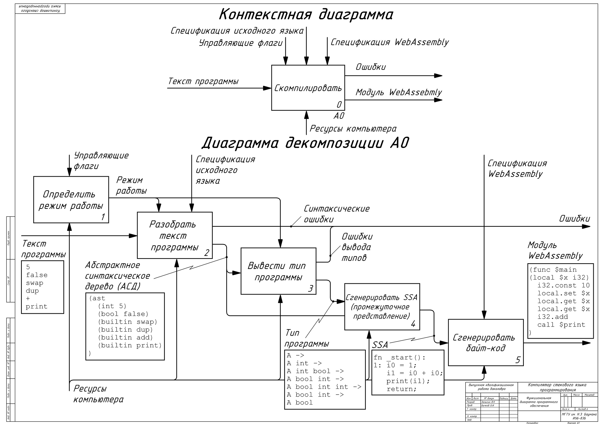
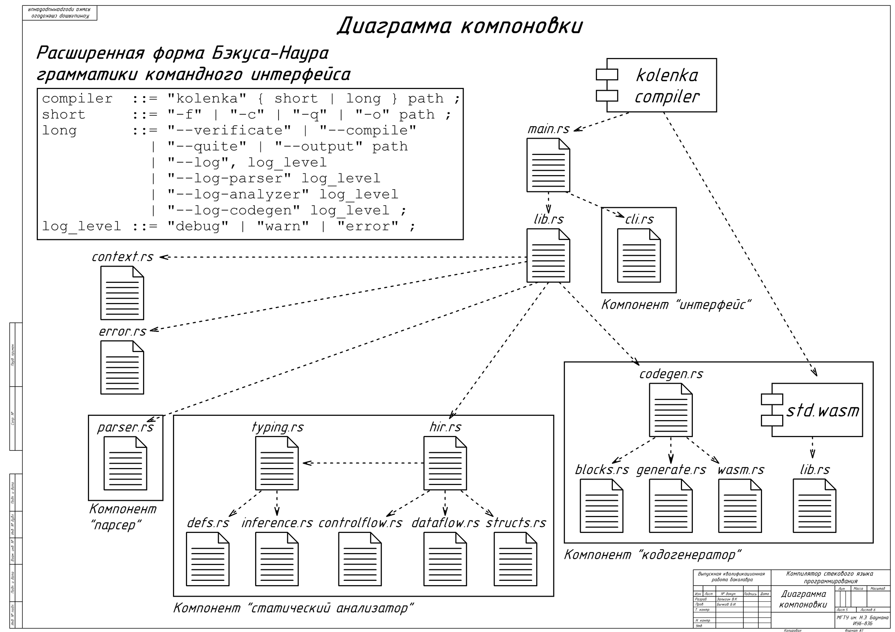
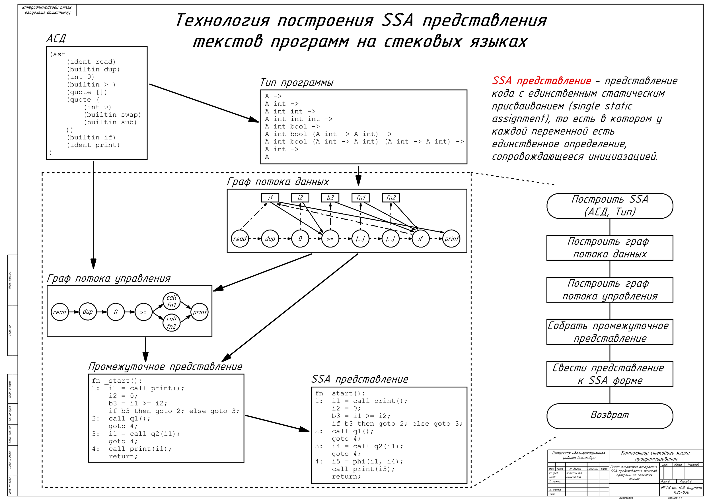

# Kolenka

Компилятор конкатентивного языка [Cat](https://github.com/cdiggins/cat-language) в модули WebAssembly.

Собрать проект `cargo build`.

Запустить -- `cargo run`.

Демонстрация работы: [ссылка](./docs/demo.mp4)

Расчетно-пояснительная записка (диплом бакалавра): [ссылка](https://github.com/vzalygin/bmstu-ics6/blob/master/vkr/rpz.pdf).

Слайды с защиты (дипломная работа):

